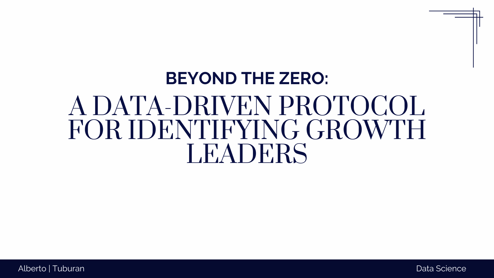

## 📌 Project Overview
This project analyzes the financial stability of companies that pay 0% tax. While this group is **12x more likely to face bankruptcy**, it represents nearly **38% of the total market** (2,568 companies).

Traditional banking logic suggests rejecting this entire segment to minimize risk. However, a blanket rejection means missing out on "Growth Leaders"—innovative companies that pay zero tax because they are aggressively reinvesting in R&D and asset expansion.

We developed a protocol using **Random Forest Classification** to help financial institutions identify these leaders while avoiding high-risk failures.

## 📊 The Dataset
We utilized the **Taiwanese Bankruptcy Prediction** dataset consisting of **6,819 firms**. It includes 95 financial attributes such as:
* **Debt Ratio %**
* **Total Asset Growth Rate**
* **Net Income to Stockholder's Equity**
* **Research and Development Expense Rate**

These indicators were used to train a machine learning model to differentiate between healthy "Survivors" and high-risk "Zombies" specifically within the Zero-Tax demographic.

---

## 🔍 Key Business Insights

### 1. The Paradox of the "Zero-Tax" Group
While the bankruptcy rate is high (7.55%), the survivors in this group are actually **Innovation Engines**.
* **R&D Spending:** Survivors invest an average of **1.78 Billion** (vs 1.63B for failures).
* **Asset Growth:** Survivors expand assets at **5.20 Billion** (vs 4.67B for failures).

### 2. The Model Shift (Global vs. Zero-Tax)
When we trained a Random Forest model on the Global dataset versus the Zero-Tax subset, the feature importance shifted dramatically:
* **Global Model:** Prioritizes *Net Income* (Profitability).
* **Zero-Tax Model:** Prioritizes *Net Value Growth* and *Solvency* (Equity-to-Liability).

**Insight:** When profit is absent (Zero Tax), the model stops looking for income and starts looking for structural foundation and growth speed.

### 3. The "Icarus Trap" Discovery
We identified a critical risk factor: **Unchecked Growth**.
* We plotted *Asset Growth* against *Debt Ratio*.
* **Finding:** Companies that grow fast but cross the **15% Debt Ratio** limit are statistically likely to collapse.
* **Conclusion:** High growth is only safe if supported by low debt.

---

## 🛠️ The Solution: A 3-Step Lending Protocol

Based on the data, we propose a surgical lending strategy for Zero-Tax applicants:

1.  **Identify the Segment:** Is the tax rate 0%? If yes, divert to Special Protocol.
2.  **Apply the "Icarus Cap":** Reject if Debt Ratio > 15%, regardless of how fast they are growing.
3.  **Verify Stability:** Check Equity-to-Liability ratios to ensure the "Innovation Engine" has fuel.

---

## 📂 Project Structure
* `Final.ipynb`: The complete Python analysis including Data Cleaning, Random Forest modeling, and Visualization.
* `Beyond_the_zero.pdf`: The executive slide deck presenting the findings.
* `data.csv`: The dataset used for analysis.

## 💻 Tech Stack
* **Pandas:** Data manipulation and segmentation.
* **Scikit-Learn:** Random Forest Classifier for feature importance analysis.
* **Seaborn/Matplotlib:** Visualizing the "Icarus Trap" and R&D comparisons.

---

## 📢 Conclusion
We do not need to fear the "Zero." By managing the debt and verifying the equity, we can capture the market of innovators while protecting the bank's bottom line.

*Author: Alberto | Tuburan*
